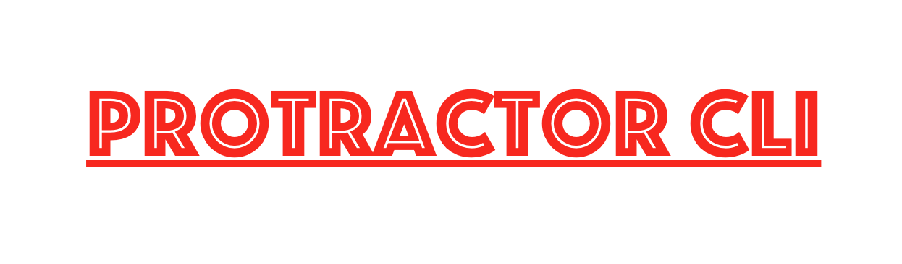

<p align="center">
[](#contributors)
[](#contributors)

</p>

<p align="center">
   <i><strong>An Interactive command line interface & config helper for ProtractorJS</strong></i>
<p>

<p align="center">
<a href="https://circleci.com/gh/igniteram/protractor-cli/tree/master"></a>
<a href="http://commitizen.github.io/cz-cli/"></a>
<a href="https://david-dm.org/igniteram/protractor-cli"></a>
<a href="https://badge.fury.io/js/cliptor"></a>
<a href="https://github.com/facebook/jest"></a>
<a href="https://opensource.org/licenses/MIT"></a>
</p>

---

### <p align="center"> [About](#about) **|** [To Get Started](#to-get-started) **|** [Installation](#installation) **|** [Commands](#commands) </p>

## About

Protractor-CLI(formerly Cliptor.js) is an interactive command line interface which helps in setting up hassle free protractor projects. It takes user's inputs for generating protractor config files and also downloads the dependencies needed for writing e2e tests.

<p>
  
</p>

### What protractor-cli is trying to solve?

Since protractor supports multiple frameworks and has many functionalities associated with them , users face it quite challenging to know the config options and experience a hard time to choose the right library to use in their e2e projects. 

This project focuses primarily to solve these issues by generating config files based on user's input and downloads the respective dependencies automatically.

## To Get Started

#### Pre-requisites
1.NodeJS installed globally in the system.
https://nodejs.org/en/download/

## Installation

Let's start by installing protractor-cli globally with [npm](https://www.npmjs.com/).

```sh
$ npm install --global protractor-cli
```
## Commands

A global binary **cliptor** will be installed, currently it supports two primary commands - **config** & **install** with no arguments.
`cliptor --help` will show these list commands. `cliptor --version` will show the current version of cliptor. 

### config

```sh
$ cliptor config
```
Starts protractor's interactive cli, generates config files & downloads protractor related dependencies!

### install

```sh
$ cliptor install
```
This installs protractor & webdriver-manager globally, it also updates webdriver-manager which downloads **chrome**, **firefox** & **internet explorer** drivers. One can skip this step and use the `cliptor config` command if they want to run selenium server in other ways!

## Library Support

Protractor-CLI supports all the major libraries and frameworks that **Protractor** currently supports, let us have a look-

### Test Frameworks

<a href="https://jasmine.github.io/"></a>
<a href="https://mochajs.org/"></a>
<a href="https://github.com/cucumber/cucumber-js"></a>

Jasmine being the default framework. Mocha & Cucumber have good support as well!

### Transpilers

<div>


</div>


Since this project has been entirely written using [TypeScript](https://www.typescriptlang.org/). You would find extensive support for it. Protractor also has recently migrated to typescript.

You could use the typescript features by simply selecting your specific framework & transpiler option provided by protractor-cli. 

Jasmine being the default framework , protractor-cli asks whether you would want to use typescript as a transpiler which then installs **typescript**, **jasmine types** and also generates **tsconfig.json** automatically!

[Coffee-Script](http://coffeescript.org/) support has also been provided with **mocha** & **cucumber** frameworks. You could write your scripts using coffee-script and the above frameworks will auto-compile them. The best part is you don't have to do it manaully as protractor-cli does it for you!

### Browser Configuration

Protractor-CLI supports all three major browser configuration -

<div class="images" >


</div>

### Test Environments

* **Local Machine** - It is your local test development environment
* **Cloud Service** - If you want to develop and maintain your test scripts in cloud services like - **Sauce Labs** & **BrowserStack**.
* **Remote Machine** - If you know the address of a remote machine where selenium server resides you could use this environment configuration.

### Logging

Protractor has 4 types of logging mechanism -

* **info** (default)
* **warn**
* **debug**
* **error**

One could refer this [StackOverFlow link](https://stackoverflow.com/questions/2031163/when-to-use-the-different-log-levels) to understand what they are and when to use them. Normally you would have to configure these in your config file manually but now protractor-cli does it for you.

### Reports

Protractor-CLI installs & configures popular & well maintained report modules which could be integrated with protractor.

Framework | Report Types | Report Module
---       | ---          | ---          
| `Jasmine` |<br>`dot`</br><br>`spec`</br>  <br>`json`</br><br>`html`</br>|<br>Protractor jasmine's default dot console reporter</br><br>[jasmine-spec-reporter](https://github.com/bcaudan/jasmine-spec-reporter) for flashy console spec reporter</br><br>Protractor's `resultJsonOutputFile` config option generates json reports</br><br>[protractor-jasmine2-screenshot-reporter](protractor-jasmine2-screenshot-reporter) for html reports. </br>
| `Mocha` |<br>`dot`</br><br>`spec`</br>  <br>`json`</br><br>`html`</br>|<br>Mocha's default dot console reporter in mochaOpts</br><br>Built in spec console reporter </br><br>Built in mocha's json reporter</br><br>[Mochawesome](https://github.com/adamgruber/mochawesome) for html reports.
| `cucumber` |<br>`progress`</br><br>`summary`</br>  <br>`json`</br><br>`html`</br>|<br>Cucumber's default progress console reporter</br><br>Summary console reporter</br><br>Json reporter which generates cucumber json reports</br><br>[cucumber-html-reporter](https://github.com/gkushang/cucumber-html-reporter) for html reports.

### Contributions

For contributors who want to improve this repo by contributing some code, reporting bugs, issues or improving documentation - PR's are highly welcome, please maintain the coding style , folder structure , detailed description of documentation and bugs/issues with examples if possible.

#### Development Hints

Please see [DEVELOPER.md](https://github.com/igniteram/protractor-cli/blob/master/DEVELOPER.md)

### Attributions

Protractor-CLI was mainly inspired by [WebdriverIO’s](https://github.com/webdriverio/webdriverio) cli. I would also like to give credit to the Angular’s Protractor community for creating such a wonderful project which inspired this project development.
## Contributors

<!-- ALL-CONTRIBUTORS-LIST:START - Do not remove or modify this section -->
<!-- prettier-ignore -->
| [<br /><sub><b>Ram Pasala</b></sub>](https://in.linkedin.com/in/rpasala)<br />[💻](https://github.com/igniteram/protractor-cli/commits?author=igniteram "Code") [📖](https://github.com/igniteram/protractor-cli/commits?author=igniteram "Documentation") [⚠️](https://github.com/igniteram/protractor-cli/commits?author=igniteram "Tests") [🐛](https://github.com/igniteram/protractor-cli/issues?q=author%3Aigniteram "Bug reports") | [<br /><sub><b>Craig Nishina</b></sub>](https://github.com/cnishina)<br />[💻](https://github.com/igniteram/protractor-cli/commits?author=cnishina "Code") [🔌](#plugin-cnishina "Plugin/utility libraries") |
| :---: | :---: |
<!-- ALL-CONTRIBUTORS-LIST:END -->
Thanks goes to these wonderful people ([emoji key](https://github.com/kentcdodds/all-contributors#emoji-key)):

<!-- ALL-CONTRIBUTORS-LIST:START - Do not remove or modify this section -->
<!-- prettier-ignore -->
<!-- ALL-CONTRIBUTORS-LIST:END -->

This project follows the [all-contributors](https://github.com/kentcdodds/all-contributors) specification. Contributions of any kind welcome!